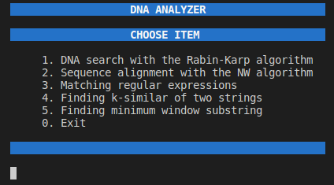
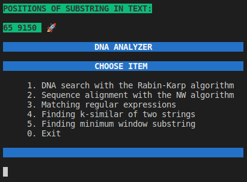
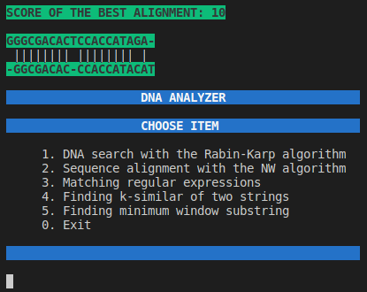
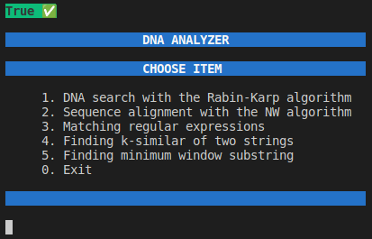
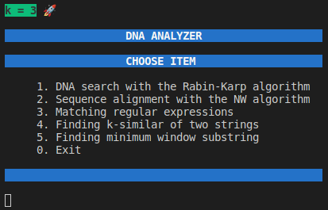
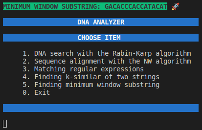

# DNA Analyzer v1.0
The "DNA Analyzer v1.0" is an app written in C++. The console application provides implementation several algorithms solving the classical bioinformatics problems, such as substring search, sequence alignment, matching regular expressions, finding k-similar and minimal window for two strings.

#### Program launch options for execution time and memory consumption check

```
/usr/bin/time -v ./build/DNA_Analizer -1 ../datasets/HIV-1_AF033819.3.txt ./resources/dna1.txt
/usr/bin/time -v ./build/DNA_Analizer -2 ./resources/dna2.txt
/usr/bin/time -v ./build/DNA_Analizer -3 ./resources/dna3.txt
/usr/bin/time -v ./build/DNA_Analizer -4 ./resources/dna4.txt
/usr/bin/time -v ./build/DNA_Analizer -5 ./resources/dna5.txt
```

## Features
- Console interface

  

- Implementation of the exact DNA search project using the Rabin-Karp algorithm.

  

- Implementation of the sequence alignment project using Needleman-Wunsch algorithm.

  

- Matching regular expressions.

  

- K-similar strings.

  

- Minimum window substring.

  

## License
Copyright (c). All rights reserved.
